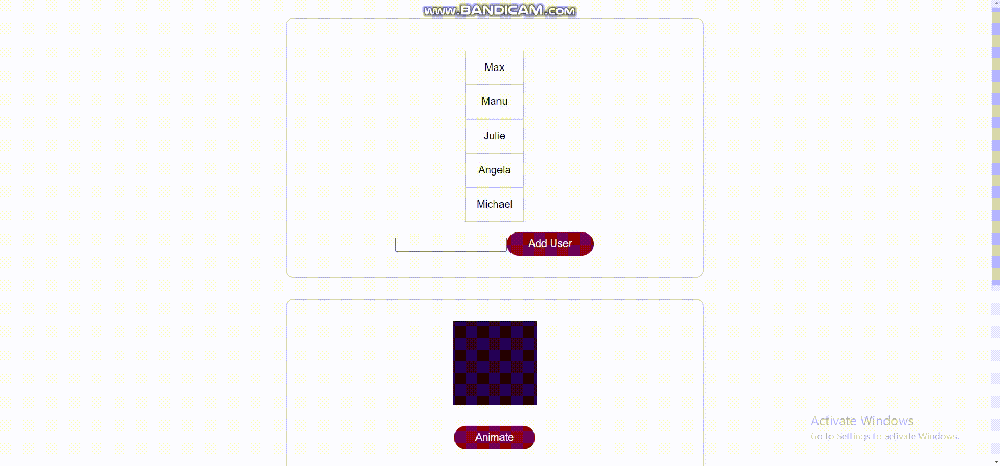

# Vue Animation App

## Table of contents:

- [About](#about)
- [Prerequisites](#prerequisites)
- [Setup](#setup)
- [Demo](#demo)

## About

It's a simple web app built using Animations and Transitions concepts built in VueJs.

## Prerequisites

You will need [Node.js](https://nodejs.org) installed on your system.

## Setup

Download the source code as a zip archive.

Once downloaded, open the terminal in the project directory, and continue with:

```
npm install
```

### Compiles and hot-reloads for development

```
npm run serve
```

### Customize configuration

See [Configuration Reference](https://cli.vuejs.org/config/).

## Demo
